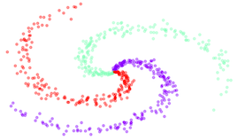

# Neural Networks Tutorial

This repo contains Jupyter notebooks for a tutorial covering Logistic Regression, Multilayer Perceptrons, and Convolutional Neural Networks using Keras.

### Getting Started
* Install Docker locally.
* Run `./scripts/update` to build a Docker image.
* Run `./scripts/jupyter` to start the Jupyter web app.
* In a web browser, go to the URL displayed by the previous command.

### Further reading
* https://ujjwalkarn.me/2016/08/11/intuitive-explanation-convnets/
* http://cs231n.stanford.edu/syllabus.html
* http://cs229.stanford.edu/materials.html
* http://www.fast.ai/
* https://blog.keras.io/
* http://scs.ryerson.ca/~aharley/vis/conv/flat.html
